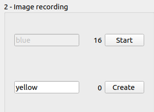
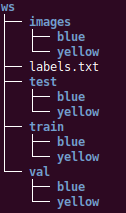

# ai_nano
The goal of this program is to train a deep learning model on a deep learning server with a GPU card then launch this model on a Jetson Nano board, all this with a GUI on another computer. This program is ispired by https://github.com/dusty-nv/jetson-inference

It can be used during practical session if you have no HDMI screen for your Nano board. So, students launch this programm on their own computer and access remotly to the Deep Learning (DL) machine for training and to the Jetson Nano for inference on webcam images.

# User's guide
Before running the program, your computer must be connected to the DL machine and to some Jetson Nano computers. Your computer must have a webcam too.

Don't forget to fill the *config.json* file with the appropriate IP address, login and password for this computers.
To launch the program :

```
python3 ai_nano.py
```
You should see this GUI.


This is a step-by-step software to capture images, train a DL model and make some inferences.

Follow steps in sequential order :

## Step 1 : Project generation
Select the Working Space (where all the images will be stored), the number of classes that you want your model be able to classify and select the webcam to work with.

Next, press the **Project OK** button to create the class forms in the **Image recording** part.
## Step 2 : Image recording
If you previously select 2 classes, this 2 class forms appear.



After having filled the name for a class, push the **Create button** then press the **Start** button to begin image recording and **Stop** when you have enough images.
## Step 3 : Image spliting in train, val and test folders
Split all the previously recorded images into *test*, *val* and *train* sub-directories and create the *labels.txt* file (with all the class names).



## Step 4 : Upload data to DL machine
Send this directories to the DL machine with SFTP (an SFTP server must run on the DL computer)
## Step 5 : Train model
Train the model on the DL machine. It can take a long time because it runs 35 epochs.

Wait until you see in the log display:
```
End training model
```
## Step 6 : Convert to ONNX model
Convert the model which has been generated by **Pytorch** in the **ONNX** format to be lauchable by **TensorRT** on the Nano computer.

Wait until you see in the log display:
```
End conversion to ONNX file
```
## Step 7 : Upload model to Jetson Nano
Upload the **ONNX** model file from DL machine to the selected Nano computer.

Wait until you see in the log display:
```
End upload ONNX model to Jetson Nano.
```
## Step 8 : Inference with nano
Run the classification of acquired images from the Nano's camera. The first time, it takes a very long time because TensorRT has to convert the model.
You'll see the classification results in the log display.


On the Jetson Nano, there's a LED per class. When a class is recognized, its LED brights

Here's the correspondance : 
* class 0 => pin 12
* class 1 => pin 16
* class 2 => pin 18


## Other workflows
If you select a non empty working space directory, you can directly access to the step 4 (no image recording needed).

At the beginning, if there's models on the Jetson Nano, you can select one and directly start inferences (if you don't need to train a new model)


# Software architecture

This software involves 3 computers : 
1. the computer which runs the GUI (ai_nano.py), where we get the images from the webcam.
2. the Deep Learning computer which trains the model
3. the Jetson Nano which runs the DL model for inference of webcam images.

All this computers communicate with SSH and SFTP.

On the DL machine, in the */home/nano*, here's the files : 


The *models* will store all the directories with the image directories (*val*,*train* and *test*) uploaded from the GUI computer.

On the Jetson Nano, we must install the Jetpack software 
https://github.com/dusty-nv/jetson-inference

In the *jetson-inference/python/examples directory*, add the *my-imagenet.py* program.

On the GUI computer, here's the files:


* **ai_nano.py** : the main file which launch the GUI specified in *ai_nano.ui*.
* **record_images.py** : the group of QWidgets to create a new class and get images from the webcam for this class.
* **thread_camera.py** : thread used to get images from the webcam and send them to the *ai_nano* program through a PyQt signal.
* **thread_command.py** : thread used to send a command with SSH to another computer, get its outputs (stdout and stderr) and send them through a PyQt signal. 
